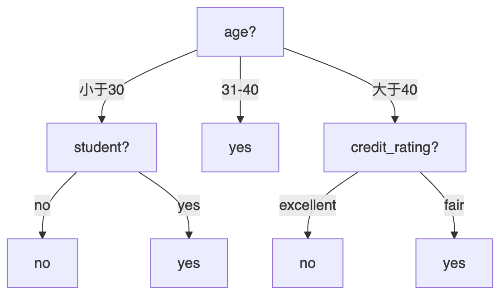
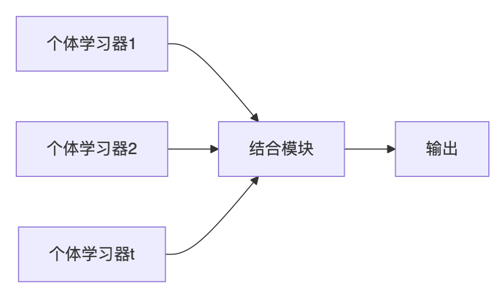

---
### ------------------- 幻灯片还是普通网页
marp: true
#marp: false

### ------------------- 幻灯片尺寸，宽版：4:3
size: 16:9
#size: 4:3

### ------------------- 是否显示页码
paginate: true  
#paginate: false

### ------------------- 页眉 (备选的用 '#' 注释掉)
# header: lianxh.cn
#header: '[连享会](https://www.lianxh.cn)'
#header: '[lianxh.cn](https://www.lianxh.cn/news/46917f1076104.html)'

### ------------------- 页脚 (备选的用 '#' 注释掉)
#footer: 'lianx.cn Marp 模板'
#footer: '连享会&nbsp;|&nbsp;[lianxh.cn](https://www.lianxh.cn)&nbsp;|&nbsp;[Bilibili](https://space.bilibili.com/546535876)'
#footer: ''
math: mathjax
---

<!-- 
Notes: 
1. 选中一段文本，按快捷键 'Ctrl+/' 可以将其注释掉；再次操作可以解除 
2. header, footer 后面的文本需要用单引号引起来，否则会有语法错误
3. '#size: 16:9' 不能写为 'size:16:9'，即 'size:' 后要有一个空格
-->


<!-- Global style: 设置标题字号、颜色 -->
<!-- Global style: 正文字号、颜色 -->
<style>
/*一级标题局中*/
section.lead h1 {
  text-align: center; /*其他参数：left, right*/
  /*使用方法：
  <!-- _class: lead -->
  */
}
section {
  font-size: 24px; 
}
h1 {
  color: blackyellow;
}
h2 {
  color: green;
}
h3 {
  color: darkblue;
}
h4 {
  color: brown;
  /*font-size: 28px; */
}
/* 右下角添加页码 */
section::after {
  /*font-weight: bold; */
  /*text-shadow: 1px 1px 0 #fff; */
/*  content: 'Page ' attr(data-marpit-pagination) ' / ' attr(data-marpit-pagination-total); */
  content: attr(data-marpit-pagination) '/' attr(data-marpit-pagination-total); 
}
header,
footer {
  position: absolute;
  left: 50px;
  right: 50px;
  height: 25px;
}
</style>

# 第2讲：监督学习与集成学习概论


--- -- -
## Part A. 惩罚项线性回归

### 一、什么是惩罚项？为什么要加入惩罚项？

惩罚项加在目标函数中。例如：最小二乘法的目标函数是 **残差平方和 $\sum_ {i = 1} ^ {N} \left(y _ {i} - x _ {i} ^ {\prime} \beta\right) ^ {2}$ 最小**，而岭回归加入了 $\lambda \| \beta \| _ {2} ^ {2}$ 作为惩罚项：

$$
\min  _ {\beta} \sum_ {i = 1} ^ {N} \left(y _ {i} - x _ {i} ^ {\prime} \beta\right) ^ {2} + \lambda \| \beta \| _ {2} ^ {2}
$$

惩罚项的作用是：对估计系数进行收缩。

为什么要收缩估计系数？  —— 为了降低均方误差

--- -- -

一个预测方法，通常以 **最小化均方误差（MSE）** 为目标。均方误差可以分解为偏差和方差：

$$
\text{MSE}(\hat{\beta}) = \mathbb{E}[(\hat{\beta} - \beta)^2] =  (\mathbb{E}[\hat{\beta}] - \beta)^2 + \text{Var}(\hat{\beta}) 
$$

James and Stein (1961) 发现，对 $\hat{\beta}^{OLS}$ 以一定比例进行缩小，可以降低 MSE。


通过缩小系数降低了方差，但牺牲了无偏性。

--- -- -

### 二、岭回归（Ridge regression）（L2 惩罚项）

目标函数：$\min  _ {\beta} \sum_ {i = 1} ^ {N} \left(y _ {i} - x _ {i} ^ {\prime} \beta\right) ^ {2} + \lambda \| \beta \| _ {2} ^ {2}$

等价于：$\min  _ {\beta} \sum_ {i = 1} ^ {N} \left(y _ {i} - x _ {i} ^ {\prime} \beta\right) ^ {2}, \quad s.t.  \sum_{j=1}^p \beta_j^2 \le \tau$


对不同 $\hat{\beta}_j$ 的惩罚力度和解释变量的量纲有关，所以用惩罚项线性回归之前，都应该先把解释变量标准化

--- -- -

### 三、Lasso（L1 惩罚项）

目标函数：$\min  _ {\beta} \sum_ {i = 1} ^ {N} \left(y _ {i} - x _ {i} ^ {\prime} \beta\right) ^ {2} + \lambda \| \beta \| _ {1}$

等价于：$\min  _ {\beta} \sum_ {i = 1} ^ {N} \left(y _ {i} - x _ {i} ^ {\prime} \beta\right) ^ {2}, \quad s.t.  \sum_{j=1}^p | \beta_j | \le \tau$


相比起岭回归，Lasso 有特征选择的功能。

--- -- -

### 四、弹性网（Elastic Net）（L1 + L2 惩罚项）

目标函数：
$$
\min  _ {\beta} \sum_ {i = 1} ^ {N} \left(y _ {i} - x _ {i} ^ {\prime} \beta\right) ^ {2} + \lambda_ {1} \| \beta \| _ {1} + \lambda_ {2} \| \beta \| _ {2} ^ {2}
$$

等价于：
$$
\min  _ {\beta} \sum_ {i = 1} ^ {N} \left(y _ {i} - x _ {i} ^ {\prime} \beta\right) ^ {2}, \quad s. t. \lambda_ {1} \sum_ {j = 1} ^ {p} | \beta_ {j} | + \lambda_ {2} \sum_ {j = 1} ^ {p} \beta_ {j} ^ {2} \leq \tau
$$

--- -- -

### 五、代码模拟

本部分的内容包括：
- 模拟数据集的设定
- 线性回归、Ridge、Lasso、弹性网络四个模型的训练
  - 超参调优（选择合适的惩罚项系数 $\alpha$，以及弹性网络中 L1、L2 惩罚项的比例 `l1_ratio`）
- 四个模型的结果对比
  - 回归系数
  - MSE、RMSE、R2
- 如何通过系数路径图判断解释变量之间的相关关系

--- -- -

#### 5.1 模拟数据集的设定

模拟数据集含有 1000 个观察值，20 个解释变量（x0-x19）。其中 x0-x7 为有效变量，而且 x0 和 x1 高度相关，x2、x3、x4 之间高度相关，x8-x19 为噪声。

划分训练集和测试集，对解释变量进行标准化：
```python
# 划分训练集和测试集
X_train, X_test, Y_train, Y_test = train_test_split(X, Y, test_size=0.3, random_state=42)

# 创建标准化器
scaler = StandardScaler()

# 在训练集上拟合并转换
X_train_scaled = scaler.fit_transform(X_train)

# 使用训练集的均值和标准差来标准化测试集
X_test_scaled = scaler.transform(X_test)
```

--- -- -

#### 5.2 模型训练和超参调优

线性回归：

```python
# 初始化线性回归模型
model = LinearRegression()

# 训练模型
model.fit(X_train_scaled, Y_train)

# 使用测试集进行预测
linear_pred = model.predict(X_test_scaled)
```

Ridge 回归：
```python
# 岭回归，选择超参数α
alphas = np.logspace(-3, 3, 50)  # 搜索范围从 0.001 到 1000
ridge_cv = RidgeCV(alphas=alphas, store_cv_values=True)
ridge_cv.fit(X_train_scaled, Y_train) # RidgeCV 可以同时完成超参调优和模型训练
ridge_pred = ridge_cv.predict(X_test_scaled)

# 输出最优 alpha
print(f"最佳Ridge回归α值: {ridge_cv.alpha_}") # 最佳Ridge回归α值: 10.985411419875572
```

--- -- -

Lasso：
```python
lasso_cv = LassoCV(cv=5, random_state=42)
lasso_cv.fit(X_train_scaled, Y_train)
lasso_pred = lasso_cv.predict(X_test_scaled)

# 输出最优 alpha 
print(f"最佳Lasso回归α值: {lasso_cv.alpha_}") # 最佳Lasso回归α值: 0.23899520892004975

# 计算非零系数的数量
nz_mask = lasso_cv.coef_ != 0.0
print(f"入选变量数: {nz_mask.sum()} / {len(feature_names)}") # 入选变量数: 13 / 20
```

--- -- -

弹性网络：

```python
# 拟合弹性网络回归
elastic_cv = ElasticNetCV(
    l1_ratio=[.1, .3, .5, .7, .9, .95, .99, 1],  # l1_ratio 越接近 1，弹性网络越接近 lasso
    cv=5,
    random_state=42
)
elastic_cv.fit(X_train_scaled, Y_train)
elastic_pred = elastic_cv.predict(X_test_scaled)

# 输出最优参数
print(f"最佳ElasticNet α值: {elastic_cv.alpha_}") # 最佳ElasticNet α值: 0.2414093019394442
print(f"最佳ElasticNet l1_ratio值: {elastic_cv.l1_ratio_}") # 最佳ElasticNet l1_ratio值: 0.99

# 计算非零系数的数量
nz_mask = elastic_cv.coef_ != 0.0
print(f"入选变量数: {nz_mask.sum()} / {len(feature_names)}") # 入选变量数: 13 / 20
```

--- -- -

#### 5.3 模型结果对比

```python
 feature  linear_coef  ridge_coef  lasso_coef  elastic_coef  true_coef
      x0     2.761700    7.966332    3.303334      6.262988   7.455734
      x1    14.181491    8.864605   13.430547     10.456534   9.819827
      x2     2.533653    5.299888    5.273899      4.726233   2.381397
      x3    11.698773    6.184366   10.227508      8.086659   9.342286
      x4     2.212447    4.874524    0.730595      3.403164   5.701276
      x5     6.826731    6.748868    6.600541      6.593760   6.788962
      x6     9.886913    9.717999    9.632548      9.595556   8.900821
      x7     4.744223    4.686118    4.520073      4.513061   4.686888
      x8     0.362015    0.378671    0.157604      0.166747   0.000000
      x9    -0.154569   -0.149814   -0.000000     -0.000000   0.000000
     x10     0.250574    0.261920    0.000000      0.000000   0.000000
     x11    -0.418977   -0.411667   -0.176947     -0.177602   0.000000
     x12     0.508148    0.493926    0.298722      0.288138   0.000000
     x13    -0.176998   -0.169397   -0.000000     -0.000000   0.000000
     x14    -0.257302   -0.227735   -0.058839     -0.051365   0.000000
     x15    -0.789795   -0.788229   -0.578472     -0.580173   0.000000
     x16    -0.151143   -0.136296   -0.000000     -0.000000   0.000000
     x17    -0.039105   -0.024898   -0.000000     -0.000000   0.000000
     x18    -0.206810   -0.170645   -0.000000     -0.000000   0.000000
     x19    -0.270479   -0.244988   -0.000000     -0.000000   0.000000
```

- 关注点：零系数的数量、高度相关变量（x0 和 x1，x2-x4）的系数

--- -- -

样本外预测能力：

```python
                     Model        MSE      RMSE        R²
         Linear Regression  98.955171  9.947621  0.862076
                     Ridge  98.961021  9.947915  0.862068
                     Lasso  97.034887  9.850629  0.864753
ElasticNet (l1_ratio=0.99)  97.076830  9.852758  0.864694
```

- Lasso 和弹性网络样本外预测能力较强，可能在无效特征比较多的数据集里，这两种方法能排除无效特征，避免过拟合。

--- -- -

#### 5.4 利用系数路径图判断解释变量的相关性

Lasso 的系数路径：


- 从右到左，对应 “惩罚强度” 从强到弱
- 变量的重要性顺序（真实系数大小）和路径偏离“0”的顺序基本一致（x1, x3, x6）

--- -- -

Lasso 中有效变量的系数路径：


- 独立的变量，系数路径比较平滑（x5-x7）
- 相关性强的变量，系数路径有波动，而且可能出现 “一个变量系数上升，其他相关变量系数下降” 的现象（x2-x4）

--- -- -

Ridge 回归的系数路径：


- 随着惩罚减弱，相关性强的变量的系数一开始会同步变动，然后再逐渐收敛到 $\hat{\beta}_{OLS}$


--- -- -

弹性网络（l1_ratio=0.99）的系数路径：

.png)

- 同时具有 Ridge 和 Lasso 的特征：相关性强的变量一开始系数同步变动，然后有波动地收敛至 $\hat{\beta}_{OLS}$

--- -- -

## Part B. 分类问题与树模型

### 一、什么是分类问题？
* 分类问题的目标： 将观测值分配到有限的类别中。

  * 是否是潜在的客户
  * 是否会违约
  * 是否录用
  * ……
 
* 用于训练的分类模型，称为分类器(classifier)

| 分类模型 | 优势 | 劣势 |
| :--- | :--- | :--- |
| 决策树分类 Decision Tree | 形象；便于说明；无需特征缩放；不受线性／非线性的局限 | 当数据量较小时表现差；极容易过度拟合（overfit） |
| 随机森林 Random Forest | 高效而准确 | 不易形象地说明阐述；容易过度拟合 |
--- -- -
### 二、决策树分类
#### 2.1 决策树分类原理
决策树(Breiman,1984)分为：
* 分类树：目标变量是标称或分类变量
  * 包括节点（根节点）、枝、叶、规则
* 回归树：目标变量是连续变量

分类树与回归树（Classification and Regression Trees）是一种递归划分空间的非参数方法。

- 原理：通过不断选择最佳变量与分裂点，将数据划分成纯度更高的子集；
- 常用指标：Gini 不纯度、信息增益、MSE（用于回归树）；
- 优点：可解释性强；缺点：易过拟合。

--- -- -
举个栗子：电脑店判断顾客是否买电脑

| 编号 | 年龄   | 收入 | 是否学生 | 信用状况 | 买电脑 |      | 编号 | 年龄   | 收入 | 是否学生 | 信用状况 | 买电脑 |
| :- | :---- | :--- | :------- | :------- | :----- | ---- | :-| :---- | :--- | :------ | :------ | :----- |
| 1    | ＜30   | 高   | 否       | 一般     | 不买   |      | 8    | ＜30   | 中 | 否       | 一般     | 不买   |
| 2    | ＜30   | 高   | 否       | 良好     | 不买   |      | 9    | ＜30   | 低   | 是       | 一般     | 买     |
| 3    | 30-40 | 高   | 否       | 一般     | 买     |      | 10   | ＞40   | 中 | 是       | 一般     | 买     |
| 4    | ＞40   | 中 | 否       | 一般     | 买     |      | 11   | ＜30   | 中 | 是       | 良好     | 买     |
| 5    | ＞40   | 低   | 是       | 一般     | 买     |      | 12   | 30-40 | 中 | 否       | 良好     | 买     |
| 6    | ＞40   | 低   | 是       | 良好     | 不买   |      | 13   | 30-40 | 高   | 是       | 一般     | 买     |
| 7    | 30-40 | 低   | 是       | 良好     | 买     |      | 14   | ＞40   | 中 | 否       | 良好     | 不买   |

--- -- -
#### 2.2 拆分标准
#### （1）熵（entropy）
* 熵（entropy）源于热力学的概念，是系统无序性的一种度量（数据的纯度）
* 如果一个决策树节点上的数据的类值对于所有数据都相同 （无序性最小），则熵最小
* 信息论之父——Shannon给出了信息熵的公式：
> 假定当前样本集合$D$ 中包含 n 类样本，每类样本所占的比例为$p_1, p_2, \ldots, p_n$
$$
\operatorname{Ent}(D) = \operatorname{Ent}\left(p_1, p_2, \ldots, p_n\right)=-p_1 \log _2 \boldsymbol{p}_1-p_2 \log _2 \boldsymbol{p}_2-\ldots-p_n \log _2 \boldsymbol{p}_n
$$

 * 例如 9 个样本， 根节点D包含有3 类样例，每个类别的样本数为 $\mathbf{2 , 3 , 4}$ ，则其熵为

$$
\begin{aligned}
\operatorname{Ent}(D)
&=\operatorname{Ent}\left(\tfrac{2}{9},\tfrac{3}{9},\tfrac{4}{9}\right)
= -\tfrac{2}{9}\log_2\tfrac{2}{9}-\tfrac{3}{9}\log_2\tfrac{3}{9}-\tfrac{4}{9}\log_2\tfrac{4}{9} \\
&\approx 0.4822+0.5283+0.5200=1.5305
\end{aligned}
$$

* $Ent(D)$的值越小，则$D$的纯度越高。
--- -- -
#### （2）ID3决策树 （Quinlan,1986）

> ID Iterative Dichotomise 迭代二分类器

一般计算信息增益Gain
$$
\operatorname{Gain}(D,A)
= \operatorname{Ent}(D)-\sum^V_{v=1}\frac{|D_v|}{|D|}\operatorname{Ent}(D_v)

$$
* 直观上，增益就是“划分前的不确定性”减去“划分后的加权不确定性”。
* 举个栗子：
$\operatorname{Ent}(D)=I(9,5)=-\frac{9}{14} \log _2\left(\frac{9}{14}\right)-\frac{5}{14} \log _2\left(\frac{5}{14}\right)=0.940$
--- -- -
| age       | 总数 |  买  | 不买 | $\mathrm{I}(\text{买},\text{不买})$ |
| :-------- | ---- | :--: | :--: | :---------------------------------- |
| $<30$    | 5    |  2   |  3   | 0.971                               |
| $31 - 40$ | 4    |  4   |  0   | 0                                   |
| $>40$     | 5    |  3   |  2   | 0.971                               |

* $\operatorname{Ent}_{\text {age }}(D)=\frac{5}{14} I(2,3)+\frac{4}{14} I(4,0)+\frac{5}{14} I(3,2)$

* $I(2,3)$ : ＂age $<30$＂共有 5个样本，其中 2 个买， 3 个没买。
  * $I(2,3)=-\frac{2}{5} \log _2 \frac{2}{5}-\frac{3}{5} \log _2 \frac{3}{5} \approx  0.971$  
* $I(4,0) = 0$
* $I(3,2) = -\frac{3}{5} \log _2 \frac{3}{5}-\frac{2}{5} \log _2 \frac{2}{5} \approx  0.971$

* $\operatorname{Ent}_{\text {age }}(D)=\frac{5}{14} I(2,3)+\frac{4}{14} I(4,0)+\frac{5}{14} I(3,2) \\ \approx \frac{5}{14}* 0.971 +\frac{4}{14} * 0 +\frac{5}{14} * 0.971  \approx 0.694$
--- -- -
* 因此，
$$
 \operatorname{Gain}(\operatorname{age,D})=\operatorname{Ent}(D)-\operatorname{Ent}_{\text {age }}(D)
= 0.940 - 0.694 =0.246
$$
* 同理，
  $\operatorname{Gain}( income,D )=0.029$
  $\operatorname{Gain}(student,D )=0.151$
  $\operatorname{Gain}(credit＿rating,D)=0.048$

* “Age ”属性获得了最大的信息增益。 因此就作为第一个节点。
--- -- -



--- -- -

#### （3）增益率

* 增益率 $=$ 信息增益（Gain）／分裂信息（split information，类似于熵（D））

$$
\operatorname{SplitInfo}_{\text {income }}(D)=-\frac{4}{14} \log _2 \frac{4}{14}-\frac{6}{14} \log _2 \frac{6}{14}-\frac{4}{14} \log _2 \frac{4}{14}=1.557
$$
--- -- -
#### （4） 基尼系数 (Breiman et al., 1984)

CART决策树［Breiman et al．，1984］使用＂基尼指数＂（Gini index）来选择划分属性。
> CART : Classification and Regression Tree, 著名的决策树学习算法，分类和回归任务都可以。

* 假定当前样本集合$D$ 中包含 n类样本，每类样本所占的比例为$p_1, p_2, \ldots, p_n$ 

* 数据集 $D$ 的纯度可用基尼值来度量：
$$
\begin{aligned}
\operatorname{Gini}(D) & =\sum_{k=1}^{n} \sum_{k^{\prime} \neq k} p_k p_{k^{\prime}}  =1-\sum_{k=1}^{n} p_k^2
\end{aligned}
$$
>  $\operatorname{Gini}(D)$ 反映了从数据集 $D$ 中随机抽取两个样本，其类别标记不一致的概率。

* $\operatorname{Gini}(D)$ 越小，则数据集 $D$ 的纯度越高。
* 属性 $a$ 的基尼指数定义为:

$$
\operatorname{Gini}\_\operatorname{index}(D, a)=\sum_{v=1}^V \frac{\left|D^v\right|}{|D|} \operatorname{Gini}\left(D^v\right)
$$
> 我们在候选属性集合 $A$ 中，选择那个使得划分后基尼指数最小的属性作为最优划分属性。
 $a_*=\underset{a \in A}{\arg \min } \operatorname{Gini}\_index(D,a)$ 


 --- -- -
举个栗子：有 9 个＂买＂和 5 个＂不买＂
$$
\operatorname{Gini}(D)= \frac{9}{14}*\frac{5}{14} + \frac{5}{14}*\frac{9}{14} \\= 1-\left(\frac{9}{14}\right)^2-\left(\frac{5}{14}\right)^2=0.459
$$
* 计算属性＂收入(income)＂

| income      | 总数 |  买  | 不买 | $\operatorname{Gini}(D^v)$ |
| :---------- | ---- | :--: | :--: | :----------------- |
| 高 high     | 4    |  2   |  2   |    $\frac{1}{2}$             |
| 中等 medium | 6    |  4   |  2   |        $\frac{4}{9}$            |
| 低 low      | 4    |  3   |  1   |     $\frac{3}{8}$                    |
--- -- -

$\operatorname{Gini}(D^1)= \operatorname{Gini}(high) = \frac{2}{4}* \frac{2}{4} + \frac{2}{4}* \frac{2}{4} =\frac{1}{2}$

$\operatorname{Gini}(D^2)= \operatorname{Gini}(medium) =\frac{4}{6}* \frac{2}{6}+\frac{2}{6}* \frac{4}{6} = \frac{4}{9}$

$\operatorname{Gini}(D^3)= \operatorname{Gini}(low) =\frac{3}{4}* \frac{1}{4}+\frac{1}{4}* \frac{3}{4}= \frac{3}{8}$

$$
\begin{aligned}
\operatorname{Gini}\_\operatorname{index}(D, income) &= \sum_{v=1}^V \frac{|D^v|}{|D|} \operatorname{Gini}(D^v)\\
&= \frac{4}{14}\operatorname{Gini}(high)+ \frac{6}{14}\operatorname{Gini}(medium)+\frac{4}{14}\operatorname{Gini}(low)\\
&= \frac{4}{14}*\frac{1}{2} + \frac{6}{14}*\frac{4}{9}+\frac{4}{14}*\frac{3}{8} \\
& = \frac{37}{84} \approx 0.44
\end{aligned}
$$
 --- -- -
## Part C. 集成学习概论

### 一、个体与集成学习？
集成学习（ensemble learning）通过构建并结合多个学习器来完成学习任务，有时也被称为多分类器系统（multi－classifier system）、基于委员会的学习（committee－based learning）等．


 --- -- -
#### 分类1： 是否同质

* 集成是＂同质＂的（homogeneous）: 只包含同种类型的个体学习器
   * 个体学习器亦称＂基学习器＂（base learner），相应的学习算法称为＂基学习算法＂（base learning algorithm）

* 集成是＂异质＂的（heterogenous）: 包含不同类型的个体学习器
   * 个体学习器，常称为＂组件学习器＂（component learner）或直接称为个体学习器

#### 分类2： 个体学习器的生成方式
* 序列化方法 : 个体学习器间存在强依赖关系、必须串行生成的
   * 代表是 Boosting
* 并行化方法 : 以及个体学习器间不存在强依赖关系、可同时生成的
   *  Bagging 和＂随机森林＂（Random Forest）

> 拟结合论文来讲这部分的内容：
> Baiardi, A., & Naghi, A. A. (2024). The value added of machine learning to causal inference: evidence from revisited studies. The Econometrics Journal, 27(2), 213–234.

 --- -- -
>  下一讲预告
## 第3讲：神经网络与深度学习结构

 核心目标：掌握深度学习网络结构、训练机制与发展逻辑。

### 内容结构：
- 神经网络基础
   - 感知器、激活函数
   - 多层感知器（MLP）
   - 训练机制：BP算法、梯度下降

- 深度学习结构演进
   - 卷积神经网络 CNN
   - 循环神经网络 RNN / LSTM / GRU
   - 生成对抗网络 GAN
   - 深度强化学习：价值函数与策略网络

 --- -- -
